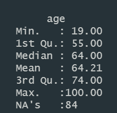

# **Kamil Peza's Google Data Analytics Capstone Project** 

# Project Summary:
For the Google Capstone project, I decided to do data analysis on
[Forbes World's Billionaires List 2022](https://www.kaggle.com/datasets/prasertk/forbes-worlds-billionaires-list-2022). This dataset that I got from Kaggle has a list of 2666 of the top billionaires in the world. I wanted to see if there are any trends with billionaires that I can copy or emulate so we can understand and become billionaires. 

 

# Ask Questions to be answered
1. Who are the youngest and oldest billionaire? (top 5 youngest and oldest)
2. What is the average age of all the billionaires?
3. How many woman billionaires are there? (who are the top 5)
4.  What are the top idustries that billionaires made their money in?
5. Which countries have the most billionaires? 

 

# Data Cleaning and Verifiying
### What did I check for:
1. Checked if each column had blanks and whether there was a reason for the blanks
2. Checked for duplicates
3. Added a Net worth Column that shows how much billions the person has shown in whole numbers

## Checked for Duplicates in Excel:

## Created new Net Worth Column:

## Blanks in age:
I noticed that there were some missing values for the age column. The reason for the missing age values was because Forbes took entire families netwroth into account as one person/row.

Added age to some of the blanks calcualted based on birth day

## Changed Sources of Income to be more consistant

     

# DATA Analysis
## *Imported excel sheet with R*
`
forbes_data <- read.csv("forbes_2022_billionaires.csv")
`
   

## *Summary of dataset in R*
`
summary(forbes_data)
`

The youngest in billionaire in the year 2022 is 19, and the oldest Billionaire is 100. The average age of all the billionaires is: 64.    

## *Top 5 youngest and oldest Billionaires*

   
  
   

# Project References:

  - https://studentwork.prattsi.org/infovis/labs/worlds-billionaires/

- https://www.forbes.com/billionaires/